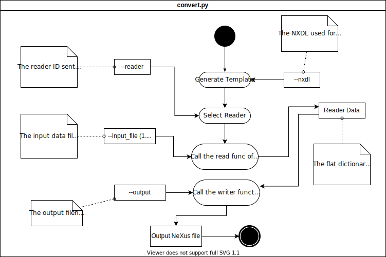

# Build your own pynxtools plugin

Your current data is not supported yet by the [built-in pynxtools readers](https://github.com/FAIRmat-NFDI/pynxtools/tree/master/src/pynxtools/dataconverter/readers) or any of the officially supported [pynxtools plugins](../reference/plugins.md)? 

Don't worry, the following how-to will guide you how to write a reader your own data.


## Getting started
You should start by creating a clean repository that implements the following structure (for a plugin called ```pynxtools-plugin```):
```
pynxtools-plugin
├── .github/workflows
├── docs
│   ├── explanation
│   ├── how-tos
│   ├── reference
│   ├── tutorial
├── src
│   ├── pynxtools_plugin
│       ├── reader.py
├── tests
│   └── data
├── LICENSE
├── mkdocs.yaml
├── dev-requirements.txt
└── pyproject.toml
```

To identify `pynxtools-plugin` as a plugin for pynxtools, an entry point must be established:
```
[project.entry-points."pynxtools.reader"]
mydatareader = "pynxtools_plugin.reader:MyDataReader"
```

Here, we will focus mostly on the `reader.py` file and how to build a reader. For guidelines on how to build the other parts of your plugin, you can have a look here:
- [Documentation writing guide](https://nomad-lab.eu/prod/v1/staging/docs/writing_guide.html)
- [Plugin testing framework](using-pynxtools-test-framework.md)

Note: There is also a [cookiecutter template](https://github.com/FAIRmat-NFDI/pynxtools-plugin-template) available for creating your own pynxtools plugin, but this is currently not well-maintained.


## Writing a Reader

The pynxtools converter allows extending support to other data formats by allowing extensions called readers.
The converter provides a dev platform to build a NeXus compatible reader by providing checking against a chosen NeXus Application Definition.



After you have established the main structure, you can start writing your reader. The new reader shall be placed in `reader.py`.

Then implement the reader function:

```python
"""MyDataReader implementation for the DataConverter to convert mydata to NeXus."""
from typing import Tuple, Any

from pynxtools.dataconverter.readers.base.reader import BaseReader

class MyDataReader(BaseReader):
    """MyDataReader implementation for the DataConverter to convert mydata to NeXus."""

    def read(
        self,
        template: dict = None,
        file_paths: Tuple[str] = None,
        objects: Tuple[Any] = None
    ) -> dict:
        """Reads data from given file and returns a filled template dictionary"""
        # Fill the template
        for path in file_paths:
            print(path)

        template["/entry/instrument/scan"] = raw_scan_data

        return template


# This has to be set to allow the convert script to use this reader. Set it to "MyDataReader".
READER = MyDataReader

```
The read function takes a template dictionary based on the provided NXDL file (similar to `dataconverter generate-template`) and the list of all the file paths the user provides.
The returned dictionary should contain keys that exist in the template as defined below.
The values of these keys have to be data objects to be populated in the output NeXus file.
They can be lists, numpy arrays, numpy bytes, numpy floats, numpy ints. Practically you can pass any value that can be handled by the `h5py` package.

The dataconverter can be executed using:

```console
user@box:~$ dataconverter --reader mydatareader --nxdl NXmynxdl --output path_to_output.nxs
```

### The reader template dictionary

Example:

```json
{
  "/entry/instrument/source/type": "None"
}
```

**Units**: If there is a field defined in the NXDL, the converter expects a filled in /data/@units entry in the template dictionary corresponding to the right /data field unless it is specified as NX_UNITLESS in the NXDL. Otherwise, you will get an exception.

```json
{
  "/ENTRY[my_entry]/INSTRUMENT[my_instrument]/SOURCE[my_source]/data": "None",
  "/ENTRY[my_entry]/INSTRUMENT[my_instrument]/SOURCE[my_source]/data/@units": "Should be set to a string value"
}
```

In case the NXDL does not define a `name` for the group the requested data belongs to, the template dictionary will list it as `/NAME_IN_NXDL[name_in_output_nexus]`
You can choose any name you prefer instead of the suggested name. This allows the reader function to repeat groups defined in the NXDL to be outputted to the NeXus file.

```json
{
  "/ENTRY[my_entry]/INSTRUMENT[my_instrument]/SOURCE[my_source]/type": "None"
}
```

For attributes defined in the NXDL, the reader template dictionary will have the assosciated key with a "@" prefix to the attributes name at the end of the path:

```json
{
  "/entry/instrument/source/@attribute": "None"
}
```

You can also define links by setting the value to sub dictionary object with key `link`:

```python
template["/entry/instrument/source"] = {"link": "/path/to/source/data"}
```

For a given NXDL schema, you can generate an empty template with the command
```console
user@box:~$ dataconverter generate-template` --nxdl NXmynxdl
```

## How to use the built-in MultiFormatReader
While building on the ```BaseReader``` allows for the most flexibility, in most cases it is desirable to implement a reader that can read in multiple file formats and then populate the template based on the read data. For this purpose, `pynxtools` has the [**`MultiFormatReader`**](https://github.com/FAIRmat-NFDI/pynxtools/blob/master/src/pynxtools/dataconverter/readers/multi/reader.py), which can be readily extended for your own data.

In case you want to make use of the `MultiFormatReader`, the following basic structure must be implemented:
```python
"""MyDataReader implementation for the DataConverter to convert mydata to NeXus."""
from typing import Tuple, Any

from pynxtools.dataconverter.readers.base.reader import ParseJsonCallbacks, MultiFormatReader

class MyDataReader(MultiFormatReader):
    """MyDataReader implementation for the DataConverter to convert mydata to NeXus."""

    def __init__(self, *args, **kwargs):
        super().__init__(*args, **kwargs)

        self.extensions = {
            ".yml": self.handle_eln_file,
            ".yaml": self.handle_eln_file,
            ".json": self.set_config_file,
            # Here, you can add functions for handling any other file extension(s)
        }
# This has to be set to allow the convert script to use this reader. Set it to "MyDataReader".
READER = MyDataReader
```

In order to understand the capabilities of the `MultiFormatReader` and which method you need to implement when extending it, we will have a look at its ```read``` method:
```python
def read(
    self,
    template: dict = None,
    file_paths: Tuple[str] = None,
    objects: Optional[Tuple[Any]] = None,
    **kwargs,
) -> dict:
    self.kwargs = kwargs
    self.config_file = self.kwargs.get("config_file", self.config_file)
    self.overwrite_keys = self.kwargs.get("overwrite_keys", self.overwrite_keys)   
```
### Template initialization and processing order
An empty `Template` object is initialized that later gets filled from the data files later.
```python
    template = Template(overwrite_keys=self.overwrite_keys)

    def get_processing_order(path: str) -> Tuple[int, Union[str, int]]:
        """
        Returns the processing order of the file.
        """
        ext = os.path.splitext(path)[1]
        if self.processing_order is None or ext not in self.processing_order:
            return (1, ext)
        return (0, self.processing_order.index(ext))

    sorted_paths = sorted(file_paths, key=get_processing_order)
```
If the reader has a `self.processing_order`, the input files get sorted in this order. If `self.overwrite_keys` is True, later files get precedent.

### Reading of input files
```python
    for file_path in sorted_paths:
        extension = os.path.splitext(file_path)[1].lower()
        if extension not in self.extensions:
            logger.warning(
                f"File {file_path} has an unsupported extension, ignoring file."
            )
            continue
        if not os.path.exists(file_path):
            logger.warning(f"File {file_path} does not exist, ignoring entry.")
            continue

        template.update(self.extensions.get(extension, lambda _: {})(file_path))
```
This parts reads in the data from all data files. The `MultiFormatReader` has an `extensions` property, which is a dictionary that for each file extension calls a function that reads in data from files with that extension. If you have e.g. an HDF5 file, you would have to add a method for handling this type of file, i.e., `self.extensions[".hdf5"] = self.handle_hdf5`. Any of these methods should take as input only the file path, e.g.
```python
def handle_eln_file(self, file_path: str) -> Dict[str, Any]
```
These methods must return a dictionary. One possibility is to return a dictionary that directly fills the template (see the `template.update` call above) with the data from the file. Another option is to return an empty dictionary (i.e., not fill the template at this stage) and only later fill the template from a config file (see below).

Note that for several input formats, standardized parser functions already exist within the `MultiFormatReader`. For example, YAML files can be parsed using the `pynxtools.dataconverter.readers.utils.parse_yml` function.

### Setting default values in the template
```python
    template.update(self.setup_template())
```
Next, you can implement the `setup_template` method, which is used to populate the template with initial data that does not come from the files themselves. This may be used to set fixed information, e.g., about the reader. As an example, you can set the `NXentry/program_name` (which is defined as the name of program used to generate the NeXus file) to be `pynxtools-plugin` by making `setup_template` return a dictionary of the form
```json
{
  "/ENTRY[my_entry]/program_name": "pynxtools-plugin",
  "/ENTRY[my_entry]/program_name/@version": "v0.1.0"
}
```

### Handling objects
```python
    if objects is not None:
        template.update(self.handle_objects(objects))
```
Aside from data file, it is also possible to directly pass any Python objects directly to the `read` function (e.g., a numpy array with measurement data). If you want to exploit this, you must implement the `handle_objects` method that should return a dictionary that populates the template.

### Parsing the config file
```python
    if self.config_file is not None:
        self.config_dict = parse_flatten_json(
            self.config_file, create_link_dict=False
        )
```
Next up, we can make us of the config file, which is a JSON file that tells the reader which input data to use to populate the template. Essentially, the config file should contain all keys that are present in the NXDL. A subset of a typical config file may look like this:
```json
{
  "/ENTRY/title": "@attrs:metadata/title", 
  "/ENTRY/USER[user]": {
    "name": "my_name",
  }, 
  "/ENTRY/INSTRUMENT[instrument]": {
    "name":"@eln",
    "temperature_sensor": {
      "value": "@attrs:metadata/temp",
      "value/@units": "K"
    }
  },
  "/ENTRY/SAMPLE[sample]": {
    "temperature_env": {
      "temperature_sensor": "@link:/entry/instrument/temperature_sensor"
    }
  },  
  "/ENTRY/data": {
    "@axes": "@data:dims",
    "AXISNAME_indices[@*_indices]": "@data:*.index",
    "@signal": "data",
    "data": "@data:mydata",
  }
}
```
Here, the `parse_flatten_json` method is used that allows us to write the config dict in the structured manner above and internally flattens it (so that it has a similar structure as the Template).

In the config file, you can
1) hard-code values (like the unit `"K"` in `"/ENTRY/INSTRUMENT[instrument]/temperature_sensor/value/@units"`) or
2) tell the reader where to search for data using the `@`-prefixes. For more on these prefixes, see below.

Note that if you want to use a `link_callback` (see below), `create_link_dict` must be set to `False`, which means that at this stage, config values of the form `"@link:"/path/to/source/data"` get NOT yet converted to `{"link": "/path/to/source/data"}`.

### Data post processing
```python
   self.post_process()
```
In case you want to do any post-processing on your data and/or config dictionary _after_ they have been read, you can implement the `post_process` method. For example, this can be helpful if you have multiple entities of a given NX_CLASS (for example, multiple detectors) and you would like to set up the config dict to fill the template with all of these entities.

### Filling the template from the read-in data
```python
    if self.config_dict:
        suppress_warning = kwargs.pop("suppress_warning", False)
        template.update(
            fill_from_config(
                self.config_dict,
                self.get_entry_names(),
                self.callbacks,
                suppress_warning=suppress_warning,
            )
        )

    return template
```

As a last step, the template is being filled from the config dict using the data. If you have more than one entry, you can implement the `get_entry_names` method which shall return a list of all entry names. The `fill_from_config` method iterates through all of the them and replaces the generic `/ENTRY/` in the config file by keys of the form `/ENTRY[my-entry]/` to fill the template.

Here, we are using **callbacks**, which are used to bring in data based on `@`-prefixes in the config file. These are defined in the reader's ``__init__`` call using the `pynxtools.dataconverter.readers.multi.ParseJsonCallbacks` class:
```python
self.callbacks = ParseJsonCallbacks(
    attrs_callback=self.get_attr,
    data_callback=self.get_data,
    eln_callback=self.get_eln_data,
    dims=self.get_data_dims,
)
```
The `ParseJsonCallbacks` class has an attribute called `special_key_map` that makes use of these callbacks to populate the template based on the starting prefix of the config dict value:
```python
self.special_key_map = {
    "@attrs": attrs_callback if attrs_callback is not None else self.identity,
    "@link": link_callback if link_callback is not None else self.link_callback,
    "@data": data_callback if data_callback is not None else self.identity,
    "@eln": eln_callback if eln_callback is not None else self.identity,
}
```
That means, if the config file has an entry ```{"/ENTRY/title": "@attrs:metadata/title"}```, the `get_attr` method of your reader gets called and should return an attribute from the given path, i.e., in this case from `metadata/title`.

By default, the MultiFormatReader supports the following special prefixes:
- `@attrs`: To get metadata from the read-in experiment file(s). You need to implement the `get_attr` method in your reader.
- `@data`: To get measurement data from the read-in experiment file(s). You need to implement the `get_data` method in your reader.
- `@eln`: To get metadata from addtional ELN files. You need to implement the `get_eln_data` method in your reader.
- `@link`: To implement a link between two entities in the NeXus file. By default, the link callback returns a dict of the form {"link": value.replace("/entry/", f"/{self.entry_name}/")}, i.e., a generic `/entry/` get replaced by the actual `entry_name`.

In addition, your reader can also implement the `get_data_dims` method, which is used to return a list of the data dimensions.

All of `get_attr`, `get_data`, and `get_eln_data`  (as well as any similar method you choose to implement) should have the same call signature:
```python
def get_data(self, key: str, path: str) -> Any:
```
Here, `key` is the config dict key (e.g., `"/ENTRY[my-entry]/data/data"`) and path is the path that comes _after_ the prefix. In the example config dict above, `path` would be `mydata`. With these two inputs, the reader should be able to return the correct data for this template key.

### Special rules
- **Lists as config value**: It is possible to write a list of possible configurations of the sort
  ```json
  "/ENTRY/title":"['@attrs:my_title', '@eln', 'no title']"
  ```
  The value most be a str of a list, with each item being a string itself. This allows to provide different options depending if the data exists for the given callback. For each list item , it is checked if a value can be returned and if so, the value is written. In this example, the converter would check (in order) the `@attrs` (with path `"my_title"`) and `@eln` (with path `""`) tokens and write the respective value if it exists. If not, it defaults to "no title".
  This concept can be particularly useful if the same config file is used for multiple measurement configurations, where for some setup, the same metadata may or not be available.

    Note that if you want to use this notation, it may be helpful to pass the `suppress_warning` keyword as `True` to your read function. Otherwise, there will be a warning for every non-existent value.

- **Wildcard notation**: There exists a wildcard notation (using `*`)
  ```json
  "/ENTRY/data/AXISNAME[*]": "@data:*.data",
  ```
  that allows you to fill multiple fields of the same type from a list of dimensions. This can be particularly helpful for writing `DATA` and `AXISNAME` fields that are all stored under similar paths in the read-in data.
  For this, you need to implement the `get_data_dims` method. For a given path, it should return a list of all data axes available to replace the wildcard.
    
    The same wildcard notation can also be used with a name to repeat entries with different names (e.g., *{my, name, etc} replaces to three keys with my, name, etc replaced, respectively). As an example, for multiple lenses and their voltage readouts, you could write:
  ```json
  "LENS_EM[lens_*{A,B,C,Foc}]": {
    "name": "*",
    "voltage": "@attrs:metadata/file/Lens:*:V",
    "voltage/@units": "V"
  },
  ```
  which would write `NXlens_em` instances named `lens_A`, `lens_B`, and `lens_Foc`.

    Note that the `get_data_dims` must correspond to all use cases, i.e., for `@data`, `@attrs`, and so on.

- **Required fields in optional groups**: There will sometimes be the situation that there is an optional NeXus group in an application definition, that (if implemented) requires some sub-element. As an example, for the instrument's energy resolution, the only value expected to come from a data source is the `resolution`, whereas other fields are hardcoded.
  ```json
  "ENTRY/INSTRUMENT[instrument]/energy_resolution": {
    "resolution": "@attrs:metadata/instrument/electronanalyser/energy_resolution",
    "resolution/@units": "meV",
    "physical_quantity": "energy"
  }
  ```
  Now, if there is no data for `@attrs:metadata/instrument/electronanalyser/energy_resolution` available in a dataset, this will be skipped by the reader, and not available, yet the other entries are present. During validation, this means that the required field resolution of the optional group energy_resolution is not present, and thus an an error would be raised:
  ```console
  LookupError: The data entry, /ENTRY[entry]/INSTRUMENT[instrument]/ELECTRONANALYSER[electronanalyser]/energy_resolution/physical_quantity, has an optional parent, /ENTRY[entry]/INSTRUMENT[instrument]/ELECTRONANALYSER[electronanalyser]/energy_resolution, with required children set. Either provide no children for /ENTRY[entry]/INSTRUMENT[instrument]/ELECTRONANALYSER[electronanalyser]/energy_resolution or provide all required ones.
  ```

    To circumvent this problem, there exists a notation using the `"!"` prefix. If you write
    ```json
    "ENTRY/INSTRUMENT[instrument]/energy_resolution/resolution": "!@attrs:metadata/instrument/electronanalyser/energy_resolution"
    ```
    the whole parent group `/ENTRY/INSTRUMENT[instrument]/energy_resolution` will _not_ be written in case that there is no value for `@attrs:metadata/instrument/electronanalyser/energy_resolution"`, thus preventing the aforementioned error.