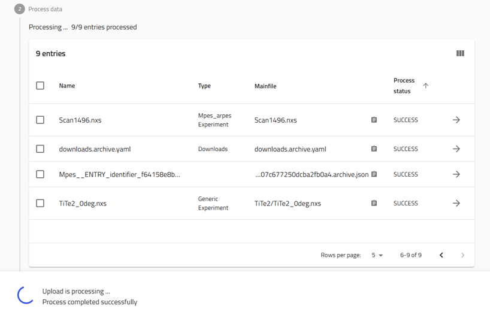
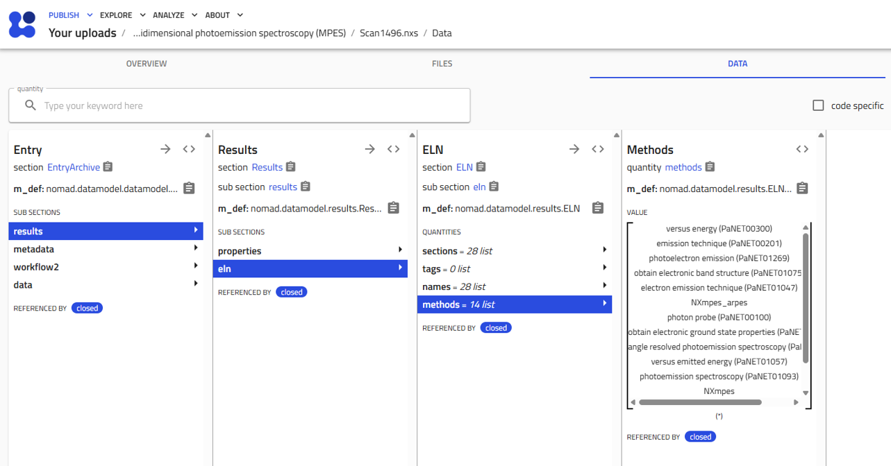

# Using the ontology service in pynxtools

!!! info "This is a how-to guide for using the ontology service. If you want to learn more about how `ontology service` works in `pynxtools`, please visit the [explanation](../../learn/pynxtools/ontology-service.md) page."

## Prerequisites

- If you plan to work on `pynxtools` and the ontology service locally, follow the [development guide](../../tutorial/contributing.md). Ensure the NeXusOntology and definitions submodules [are initialized](../../tutorial/contributing.md#development-installation).
- Python 3.10+
- You will first need to install pynxtools and its dependencies (see [pyproject.toml](https://github.com/FAIRmat-NFDI/pynxtools/blob/master/pyproject.toml)), including owlready2, pygit2, fastapi. For more information about the installation, see [installation guide](../../tutorial/installation.md)

!!! note "NeXusOntology and definitions submodules"
    === "Using pynxtools (standard installation)"
        If you are simply using `pynxtools` as a package, the NeXusOntology and definitions submodules are included automatically during installation. Follow the [installation guide](../../tutorial/installation.md) to get started.

    === "Developing the ontology service"
        If you are contributing to or developing the ontology service, you need to manually initialize the submodules. See the [development guide](../../tutorial/contributing.md#development-installation) for instructions on setting up the development environment.

## Getting started

### Importing and using the service

The main entry point is the FastAPI app defined in [`pynxtools.nomad.apis.ontology_service`](https://github.com/FAIRmat-NFDI/pynxtools/blob/ontology-service/src/pynxtools/nomad/apis/ontology_service.py). You can import and use the service as follows:

```python
from pynxtools.nomad.apis.ontology_service import app, load_ontology, fetch_superclasses
```

## Configuring ontology imports

The ontologies used by the ontology service in `pynxtools` are configurable via the [`nomad.yaml`](https://nomad-lab.eu/prod/v1/docs/howto/develop/setup.html#nomadyaml) configuration file. This allows you to control exactly which ontologies are loaded and reasoned over.

To specify which ontologies to import, add their URLs under the `plugins.options.pynxtools.nomad.apis:ontology_service.imports` section in your `nomad.yaml`:

```yaml
plugins:
  options:
    pynxtools.nomad.apis:ontology_service:
      imports:
        - "https://raw.githubusercontent.com/pan-ontologies/esrf-ontologies/refs/heads/oscars-deliverable-2/ontologies/esrfet/ESRFET.owl"
        - "http://purl.org/pan-science/PaNET/PaNET.owl"
```

By default, the [ESRFET](https://github.com/pan-ontologies/esrf-ontologies) and [PaNET](https://bioportal.bioontology.org/ontologies/PANET) ontology are imported, like in the example.

**Important:**  
Even if an ontology (e.g., [ESRFET](https://github.com/pan-ontologies/esrf-ontologies)) references another ontology (e.g., [PaNET](https://bioportal.bioontology.org/ontologies/PANET)) via `owl:imports`, you must still list both URLs explicitly in the imports. The ontology service only loads the ontologies specified in the configuration and does not automatically follow `owl:imports` statements.

For details on using `pynxtools` as a NOMAD plugin, refer to the [development guide](../pynxtools/../../tutorial/contributing.md#developing-pynxtools-as-a-nomad-plugin).

### Minimal working example

You can extract superclasses for a NeXus class using the ontology service's HTTP API endpoint. Here's an example using Python's `requests` library:

```python
import requests

# Replace with the actual running service URL
base_url = "http://localhost:8000/nomad-oasis/"
class_name = "NXmpes_arpes"
response = requests.get(f"{base_url}/superclasses/{class_name}")
if response.status_code == 200:
  superclasses = response.json().get("superclasses", [])
  print(superclasses)
else:
  print(f"Error: {response.status_code} - {response.text}")
```

This endpoint returns a JSON object with the list of superclasses for the given NeXus class name, as used internally in [pynxtools](https://github.com/FAIRmat-NFDI/pynxtools/blob/ontology-service/src/pynxtools/nomad/schema.py).

## How it works in NOMAD

When you upload a NeXus file to NOMAD, the ontology service is automatically triggered during data processing. Here's what happens:

1. **Triggering**: During normalization, NOMAD reads the `definition__field` from NeXus entry (e.g., `NXmpes_arpes`).

    { width="800" }
    { width="800" }

2. **Querying**: The service loads the ontology (or generates it if not already present) and retrieves all superclasses for that application definition.

3. **Storing results**: The retrieved superclasses are stored in `results.eln.methods` in the NOMAD archive.

    { width="800" }
