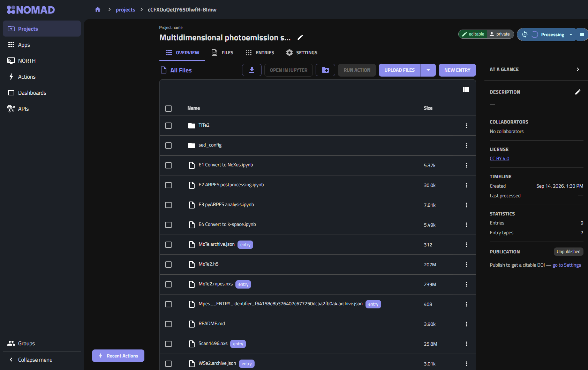
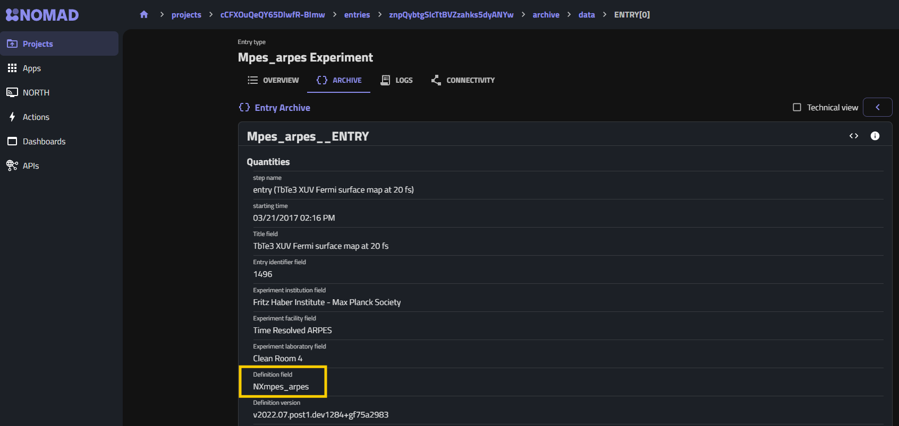
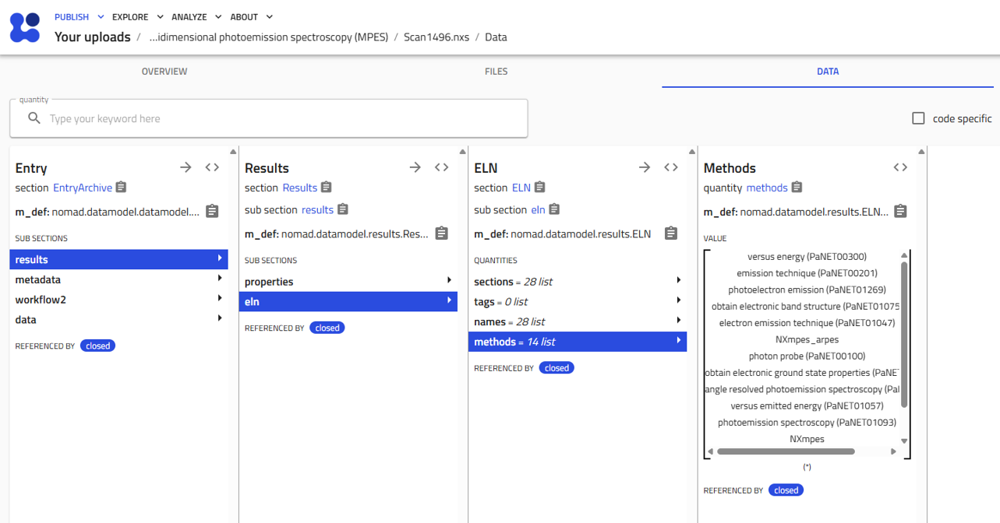

# Using the ontology service in pynxtools

!!! info "This is a how-to guide for using the ontology service. If you want to learn more about how `ontology service` works in `pynxtools`, please visit the [explanation](../../learn/pynxtools/ontology-service.md) page."

## Prerequisites

- If you plan to work on `pynxtools` locally, follow the [development guide](../../tutorial/contributing.md). Ensure the `definitions` submodule [is initialized](../../tutorial/contributing.md#development-installation) — no submodule is needed for the ontology service itself; `pynxtools` downloads its pinned [NeXusOntology release](https://github.com/FAIRmat-NFDI/NeXusOntology/releases) automatically.
- Python 3.10+
- The ontology service itself lives in the separate [`nomad-ontology-service`](https://github.com/FAIRmat-NFDI/nomad-ontology-service) plugin. Install `pynxtools` with the `ontology` extra (`pynxtools[ontology]`) to pull it in, alongside `owlready2`, `requests`, and `fastapi`. For more information about the installation, see the [installation guide](../../tutorial/installation.md).

## Getting started

### Importing and using the service

The FastAPI app is defined in [`nomad_ontology_service.apis.app`](https://github.com/FAIRmat-NFDI/nomad-ontology-service/blob/main/src/nomad_ontology_service/apis/app.py), in the `nomad-ontology-service` plugin (not in `pynxtools`). On the `pynxtools` side, `ensure_ontology_initialization` (in [`pynxtools.nomad`](https://github.com/FAIRmat-NFDI/pynxtools/blob/master/src/pynxtools/nomad/__init__.py)) prepares the ontology file that service reads:

```python
from pynxtools.nomad import ensure_ontology_initialization
```

## Configuring ontology imports

The ontologies used by the ontology service are configurable via the [`nomad.yaml`](https://nomad-lab.eu/prod/v1/docs/howto/develop/setup.html#nomadyaml) configuration file. This allows you to control exactly which ontologies are loaded and reasoned over.

To specify which ontologies to import, add their URLs under the `nomad_ontology_service:ontology_service` entry point's `ontologies` option in your `nomad.yaml`:

```yaml
plugins:
  entry_points:
    options:
      nomad_ontology_service:ontology_service:
        ontologies:
          - name: nexus
            owl_url: "nomad_tmp://pynxtools/NeXusOntology_inferred.owl"
            imports:
              - "https://raw.githubusercontent.com/pan-ontologies/esrf-ontologies/refs/heads/oscars-deliverable-2/ontologies/esrfet/ESRFET.owl"
              - "http://purl.org/pan-science/PaNET/PaNET.owl"
            PaNET_methods_class: "PaNET00003"
            NeXus_application_class: "NeXusApplicationClass"
```

By default, the [ESRFET](https://github.com/pan-ontologies/esrf-ontologies) and [PaNET](https://bioportal.bioontology.org/ontologies/PANET) ontologies are imported, like in the example.

**Important:**  
Even if an ontology (e.g., [ESRFET](https://github.com/pan-ontologies/esrf-ontologies)) references another ontology (e.g., [PaNET](https://bioportal.bioontology.org/ontologies/PANET)) via `owl:imports`, you must still list both URLs explicitly in `imports`. `pynxtools` merges exactly the ontologies listed here (plus the downloaded NeXusOntology base) before running the reasoner; it does not automatically follow `owl:imports` statements beyond that.

For details on using `pynxtools` as a NOMAD plugin, refer to the [development guide](../pynxtools/../../tutorial/contributing.md#developing-pynxtools-as-a-nomad-plugin).

### Minimal working example

You can extract superclasses for a NeXus class using the ontology service's HTTP API endpoint. Here's an example using Python's `requests` library:

```python
import requests

# Replace with the actual running service URL and configured ontology name
base_url = "http://localhost:8000/nomad-oasis/ontology_service"
ontology_name = "nexus"
class_name = "NXmpes_arpes"
response = requests.get(f"{base_url}/{ontology_name}/superclasses/{class_name}")
if response.status_code == 200:
  superclasses = response.json().get("superclasses", [])
  print(superclasses)
else:
  print(f"Error: {response.status_code} - {response.text}")
```

This endpoint returns a JSON object with the list of superclasses for the given NeXus class name, as used internally in [pynxtools](https://github.com/FAIRmat-NFDI/pynxtools/blob/master/src/pynxtools/nomad/schema_packages/schema.py).

## How it works in NOMAD

When you upload a NeXus file to NOMAD, the ontology service is automatically triggered during data processing. Here's what happens:

1. **Triggering**: During normalization, NOMAD reads the `definition__field` from NeXus entry (e.g., `NXmpes_arpes`).

    { width="800" }
    { width="800" }

2. **Querying**: The service loads the ontology (or generates it if not already present) and retrieves all superclasses for that application definition.

3. **Storing results**: The retrieved superclasses are stored in `results.eln.methods` in the NOMAD archive.

    { width="800" }
