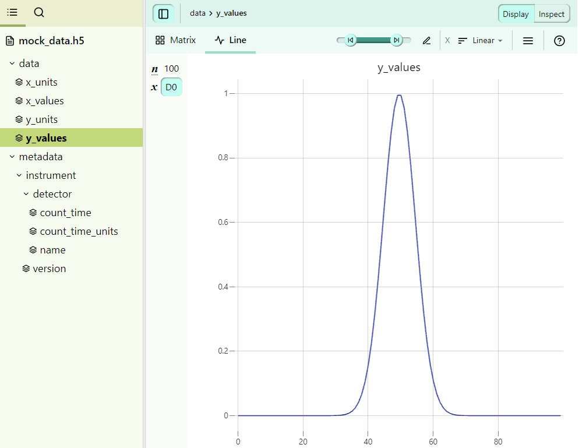

# How to use the built-in MultiFormatReader
While building on the ```BaseReader``` allows for the most flexibility, in most cases it is desirable to implement a reader that can read in multiple file formats and then populate the template based on the read data. For this purpose, `pynxtools` has the [**`MultiFormatReader`**](https://github.com/FAIRmat-NFDI/pynxtools/blob/master/src/pynxtools/dataconverter/readers/multi/reader.py), which can be readily extended for your own data. In this how-to guide, we will focus on an implementation using a concrete example. If you are also interested in the general structure of the `MultiFormatReader`, you can find more information [here](../learn/multi-format-reader.md).

## Gettting started

Here, we will implement a reader called `MyDataReader` that builds on the `MultiFormatReader`. `MyDataReader` is an example for a reader that can read HDF5 data from a specific technology-partner data set, as well as additional metadata from am electronic lab notebook (in YAML format).

For demonstration purposess, we will work with a very simple application definition, which is presented here in the [nyaml](https://github.com/FAIRmat-NFDI/nyaml) format:

```yaml
NXsimple(NXobject):
  (NXentry):
    definition:
      \@version:
      enumeration: [NXsimple]
    title:
    (NXuser):
      exists: recommended
      name:
        doc: |
          Name of the user.
      address:
        exists: recommended
        doc: |
          Name of the affiliation of the user.
    (NXinstrument):
      doc: Description of the instrument and its individual parts.
      \@version:
        doc: |
          Version of the instrument.
    (NXdetector):
      count_time(NX_NUMBER):
        unit: NX_TIME
        doc: |
          Elapsed actual counting time
        exists: recommended
    sample(NXsample):
      name:
      physical_form:
        exists: recommended
      temperature(NX_FLOAT):
        exists: recommended
        unit: NX_TEMPERATURE
    data(NXdata):
      doc: |
        The default NXdata group containing a view on the measured data.
```

The NXDL requires a user, some sample information, some instrument metadat, and the measured data to be written. Some groups, fields, and attributes are also recommended (i.e., not strictily neccessary).


We first start by implementing the class and its ``__init__`` call:
```python
"""MyDataReader implementation for the DataConverter to convert mydata to NeXus."""
from typing import Tuple, Any

from pynxtools.dataconverter.readers.base.reader import ParseJsonCallbacks, MultiFormatReader

class MyDataReader(MultiFormatReader):
    """MyDataReader implementation for the DataConverter to convert mydata to NeXus."""

    def __init__(self, *args, **kwargs):
        super().__init__(*args, **kwargs)

        self.extensions = {
            ".yml": self.handle_eln_file,
            ".yaml": self.handle_eln_file,
            ".json": self.set_config_file,
            ".hdf5": self.handle_eln_file,
            ".h5": self.handle_eln_file,
        }

READER = MyDataReader
```
Note that here we are adding handlers for three types of data file extensions:
1) `".hdf5"`, `".h5"`: This will be used to parse in the (meta)data from the instrument's HDF5 file.
2) `".yml"`, `".yaml"`: This will be used to parse in the (meta)data from the ELN file.
3) `".json"`: This will be used to read in the **config file**, which is used to map from the (meta)data concepts from the instrument and ELN data to the concepts in the NXDL file.

## Reading in the instrument's data
First, we will have a look at the HDF5 file (you can download all of the data [here]()):



Here, we see that we have a `data` group with x and y values, as well as some additional metadata for the instrument.

Here is one way to implement the 
```python
import h5py

def handle_hdf5_file(filepath):
    def recursively_read_group(group, path=""):
        result = {}
        for key, item in group.items():
            new_path = f"{path}/{key}" if path else key
            if isinstance(item, h5py.Group):
                # Recursively read subgroups
                result.update(recursively_read_group(item, new_path))
            elif isinstance(item, h5py.Dataset):
                # Read datasets
                result[new_path] = item[()]
        return result

    # Open the HDF5 file and read its contents
    with h5py.File(filepath, "r") as hdf:
        self.hdf5_data = recursively_read_group(hdf)

    return {}
```
`self.hdf5_data` will look like this:
```python
{
    "data/x_values": array([-10.        ,  -9.7979798 ,  -9.5959596 , ...,  10.        ]),
    "data/y_values": array([3.72665317e-06, 6.14389891e-06, 1.00262383e-05, ..., 3.72665317e-06]),
    "data/x_units": 'eV',
    "data/y_units": 'counts_per_second',
    "metadata/instrument/version": 1.0,
    "metadata/instrument/detector/name": 'my_gaussian_detector',
    "metadata/instrument/detector/count_time": 1.2,
    "metadata/instrument/detector/count_time_units": 's',
}
```
Note that here we are returning an empty dictionary because we don't want to fill the template just yet, but only read in the HDF5 data for now. We will use the config file later to fill the template with the read-in data.

## ELN file
As we can see in the application definition `NXsimple` above, there are some concepts defined for which there is no equivalent metadata in the HDF5 file. We are therefore using a YAML ELN file to add additional metadata.
The ELN file `eln_data.yaml` looks like this:
```yaml
user:
  name: John Doe
  address: 123 Science Rd, Data City, DC
sample:
  name: my_sample
  sample_id: sample_20
  physical_form: powder
```

It contains metadata about the user and the sample that was measured.

We know need to write a function to read in this ELN data. Luckily, there exists already a solution within `pynxtools`, using the `parse_yaml` function:
```python
from pynxtools.dataconverter.readers.utils import parse_yml

def handle_eln_file(self, file_path: str) -> Dict[str, Any]:
    self.eln_data = parse_yml(
        file_path,
        parent_key="/ENTRY",
    )

    return {}
```
When this method is called, `self.eln_data` will look like this:
```python
{
    "ENTRY/user/name": "John Doe",
    "ENTRY/address/name": "123 Science Rd, Data City, DC",
    "ENTRY/sample/name": "powder",
    "ENTRY/sample/physical_form": "my_sample",
    "ENTRY/user/temperature": 300,
    "ENTRY/user/temperature/units": "K",
```
Note that here we are using `parent_key="/ENTRY"`, meaning that each key in `self.eln_data` will start with `"/ENTRY"`. This will be important later

## Parsing the config file
Finally, we need to design our config file that  to the template . The config file looks like this:

Next up, we can make us of the config file, which is a JSON file that tells the reader how to map the concepts from the HDF5 and ELN files in order to populate the template designed to match `NXsimple`.
Essentially, the config file should contain all keys that are present in the NXDL. In our case, the config file looks like this:

```json
{
  "/ENTRY/title": "@eln:title", 
  "/ENTRY/USER[user]": {
    "name":"@eln:user/name",
    "address":"@eln:user/address"
  }, 
  "/ENTRY/INSTRUMENT[instrument]": {
    "@version":"@attrs:instrument/version",
    "DETECTOR[detector]":{
      "count_time":"@attrs:instrument/detector/count_time",
      "count_time/@units":"@attrs:instrument/detector/count_time_units"
    }
  },
  "/ENTRY/SAMPLE[sample]": {
    "name":"@eln:sample/name",
    "physical_form":"@eln:sample/physical_form",
    "temperature":"@eln:sample/temperature",
    "temperature/@units":"@eln:sample/temperature/@units"
  },

  "/ENTRY/data": {
    "@axes":["x_values"],
    "@signal": "data",
    "data": "@data:y_values",
    "x_values": "@data:x_values"
  }
}
```

## Filling the template from the read-in data
Finally, after reading in all of the data and metadata as well as designing the config file, we can start filling the template. For this, we must implement functions that are called using the reader's **callbacks**.

We will start with the `@attrs` prefix, associated with the `attrs_callback`. We must implement the `get_attrs` mehthod:
```python
def get_attr(self, key: str, path: str) -> Any:
    """
    Get the metadata that was stored in the main file.
    """
    if self.hdf5_data is None:
        return None

    return self.hdf5_data.get(path)
```

For the ELN data, we must implement the `get_eln_data` function that gets called from the `eln_callback` when using the `@eln` prefix:
```python
def get_eln_data(self, key: str, path: str) -> Any:
    """Returns data from the given eln path."""
    if self.eln_data is None:
        return None

    return self.eln_data.get(path)
```

Finally, we also need to adddress the `@data` prefix, which gets used in the `data_callback` to populate the NXdata group in the template. Note that here we use the same `@data` prefix to fill the `x_values` as well as the `data` (from `y_values`) fields. We achieve this by using the path that follows `@data:` in the config file:
```python
def get_data(self, key: str, path: str) -> Any:
    """Returns measurement data from the given hdf5 path."""
    try:
        return self.hdf5_data.get(path)
    except AttributeError:
        logger.warning(f"No axis name corresponding to the path {path}".)  
```

## Bringing it all together
Et voilà! That's all we need to read in our data and populate the `NXsimple` template. Our final reader looks like this:

```python
"""MyDataReader implementation for the DataConverter to convert mydata to NeXus."""
from typing import Tuple, Any

from pynxtools.dataconverter.readers.base.reader import MultiFormatReader
from pynxtools.dataconverter.readers.utils import parse_yml

class MyDataReader(MultiFormatReader):
    """MyDataReader implementation for the DataConverter to convert mydata to NeXus."""

    def __init__(self, *args, **kwargs):
        super().__init__(*args, **kwargs)

        self.extensions = {
            ".yml": self.handle_eln_file,
            ".yaml": self.handle_eln_file,
            ".json": self.set_config_file,
            ".hdf5": self.handle_eln_file,
            ".h5": self.handle_eln_file,
        }
    
    def handle_hdf5_file(filepath):
        def recursively_read_group(group, path=""):
            result = {}
            for key, item in group.items():
                new_path = f"{path}/{key}" if path else key
                if isinstance(item, h5py.Group):
                    # Recursively read subgroups
                    result.update(recursively_read_group(item, new_path))
                elif isinstance(item, h5py.Dataset):
                    # Read datasets
                    result[new_path] = item[()]
            return result

        # Open the HDF5 file and read its contents
        with h5py.File(filepath, "r") as hdf:
            self.hdf5_data = recursively_read_group(hdf)

        return {}
    
    def handle_eln_file(self, file_path: str) -> Dict[str, Any]:
        self.eln_data = parse_yml(
            file_path,
            parent_key="/ENTRY",
        )

        return {}

        import h5py

    def get_attr(self, key: str, path: str) -> Any:
        """
        Get the metadata that was stored in the main file.
        """
        if self.hdf5_data is None:
            return None

        return self.hdf5_data.get(path)

    def get_eln_data(self, key: str, path: str) -> Any:
        """Returns data from the given eln path."""
        if self.eln_data is None:
            return None

        return self.eln_data.get(path)

    def get_data(self, key: str, path: str) -> Any:
        """Returns measurement data from the given hdf5 path."""
        if path.endswith("x_values", "y_values"):
            return self.hdf5_data.get(f"data/{path})
        else:
            logger.warning(f"No axis name corresponding to the path {path}".)  
   
READER = MyDataReader
```

## Using the reader
We can call our reader using the following

```console
user@box:~$ dataconverter mock_data.h5 eln_data.yaml -c config_file --reader mydatareader --nxdl NXsimple  --output output.nxs
```

The final `output.nxs` file gets automatically validated against `NXsimple`, so we can be sure that it is compliant with that application definition. It looks like this: