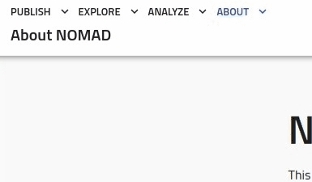
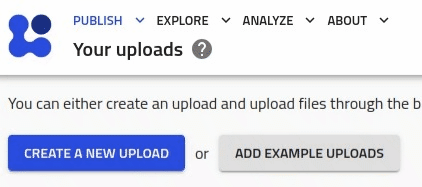
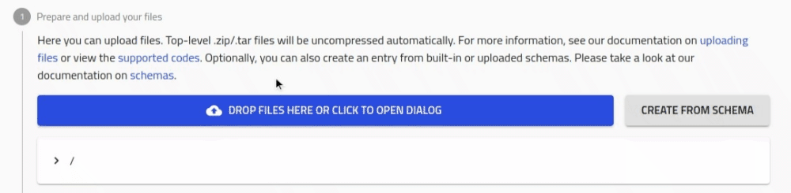
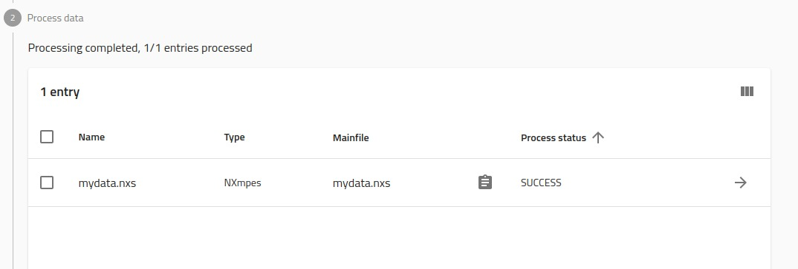
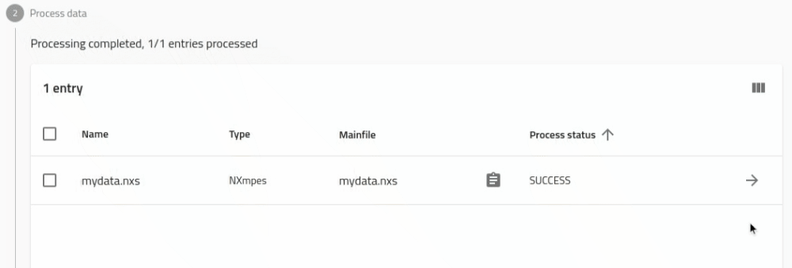
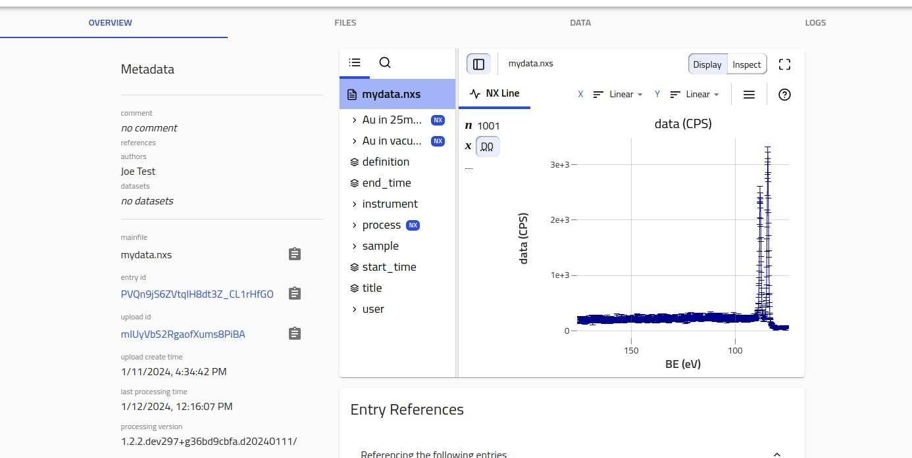

# Uploading NeXus files to NOMAD

Great choice! [Nomad](https://nomad-lab.eu/nomad-lab/tutorials.html) makes it easier than ever to work with your research data. At this point you are probably have an idea of what FAIR data is, [wilkinson et al](...). Even if you don't, it doesn't matter. Nomad provides a simple graphical interface that let's you collect and have your data ready for publication.

In this tutorial, we will go through how one can upload their NeXus files to Nomad.

Nomad, as a FAIR data platform, supports NeXus and allows users to upload their NeXus (.nxs) files directly. These files get interpreted and added to your Nomad account with complete control on how you would like to present and publish them alongside your research.

## Create an account

The very first thing you need to do is get a Nomad account if you don't have one. **!!!You can go here and click this then that**

1. Navigate to [nomad-lab.eu](https://nomad-lab.eu/prod/v1/gui/about/information)
2. Click on ```Login / Register``` on the top right corner.


## Create an Upload

Nomad allows you to have a draft working space called an **upload**. This allows you to test and prepare how your data will look in Nomad before you publish it.

Go to ```Publish -> Uploads```



<br />

Click ```Create a new upload```



## Upload your NeXus file

Now we can upload your FAIR NeXus file and let Nomad interpret it for us.

Click the ```Drop files here...``` button and choose your NeXus file from your device.


Once Nomad has interpreted your data, this is what your screen will look like.



## Browsing your NeXus data

You can find the Nomad interpretation of your data under entries. If you click on this arrow, you will be able to see an Overview of your NeXus file.



<br/>

On the Overview page you will be presented with ```H5Web``` that let's you browse the data in your ```NeXus``` file directly.



<br/>

Nomad also interprets and ```normalizes``` this data to make it interoperable with other corners of Material's research. To browse this ```normalized``` data you can browse the ```DATA``` tab. Here you see all the information Nomad has picked up and made available for search and comparison with synthesis, experimental, and computational materials data.


Feel free to explore more!
