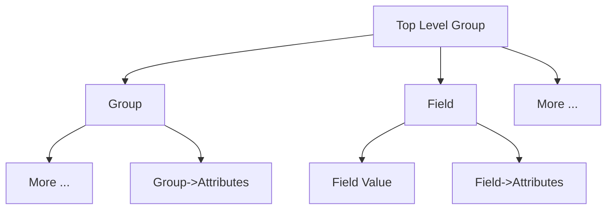
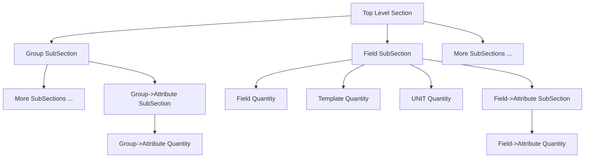
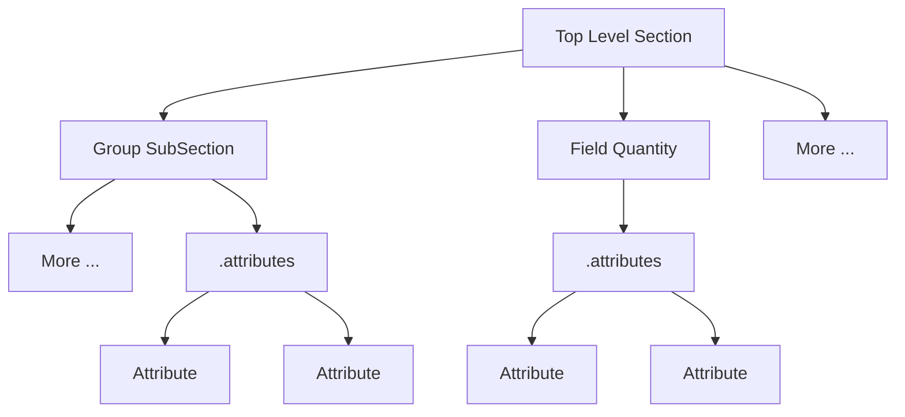

# The New Structure to Accommodate NeXus

## Brief On Previous Implementation

The previous version maps everything to a `Section`. Thus, for a typical NeXus definition structure,



It is represented as follows with `metainfo`.



## The New Mechanism

The new implementation provides an `Attribute` class that can be attached to either `Quantity` or `SubSection` via
the member `.attributes` list. For example,

```python
t_quantity = Quantity()
t_attribute = Attribute()
t_quantity.attrbutes.append(t_attribute)
```

Thus now attributes can be directly defined for each `Field`/`Group` without the need to wrap them into
`Section`/`Subsection`.



## Unit Solution

The `unit` attribute in NXDL actually stands for dimensionality. A new quantity called `Quantity.dimensionality` is
provided in `Quantity`. NeXus tokens such as `NX_LENGTH` can be parsed and defined accordingly.

The existing `Quantity.unit` functions in the normal way so that valid units, for example, `m` or `mm` can be defined.

If `Quantity.dimensionality` is defined, `Quantity.unit` will be checked against `Quantity.dimensionality` to ensure
compatibility.