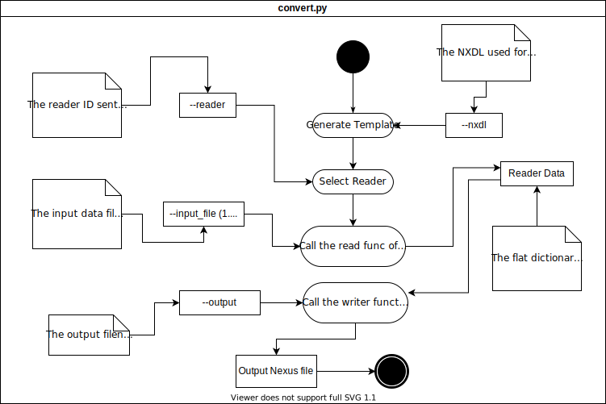

# Data Converter




Converts experimental data to Nexus/HDF5 files based on any provided NXDL.

```console
user@box:~$ python convert.py
Usage: convert.py [OPTIONS]

Options:
  --input-file TEXT    The path to the input data file to read. (Repeat for
                       more than one file.)

  --reader TEXT        The reader to use.
  --nxdl TEXT          The path to the corresponding NXDL file.  [required]
  --output TEXT        The path to the output Nexus file to be generated.
  --generate-template  Just print out the template generated from given NXDL
                       file.

  --help               Show this message and exit.
```

#### Use with multiple input files

```console
user@box:~$ python convert.py --nxdl nxdl --input_file metadata --input_file data.raw --input_file otherfile
```

## Installation

1, Clone the repo using: git clone https://github.com/nomad-coe/nomad-parser-nexus.git --recursive\
2. From the root folder where the setup.py exists, run: pip install -e .

```console
user@box:~$ git clone https://github.com/nomad-coe/nomad-parser-nexus.git --recursive
user@box:~$ cd nomad-parser-nexus
user@box:~$ git checkout data-converter
user@box:~$ pip install -e .
user@box:~$ cd nexusparser/tools/dataconverter
```

For now, I have made sure that this tools works on this branch.

## Writing a Reader

Readers have to be placed in the **readers** folder. The reader Python files should end in ```_reader.py```.

Copy and rename ```readers/example_reader.py``` to your own reader file.
Then implement the reader function:

```python
"""MyDataReader implementation for the DataConverter to convert mydata to Nexus."""
from typing import Tuple

from nexusparser.tools.dataconverter.readers.base_reader import BaseReader


class MyDataReader(BaseReader):
    """MyDataReader implementation for the DataConverter to convert mydata to Nexus."""

    def read(self, template: dict = None, file_paths: Tuple[str] = None) -> dict:
        """Reads data from given file and returns a filled template dictionary"""
        # Fill the template
        for path in file_paths:
            print(path)

        template["/entry/instrument/scan"] = raw_scan_data

        return template


# This has to be set to allow the convert script to use this reader. Set it to "MyDataReader".
READER = MyDataReader

```

This function takes a template dictionary based on the provided NXDL file (similar to ```--generate-template```) and the list of all the file paths the user provides with ```--input```.
The returned dictionary should contain keys that correspond to paths in the NXDL and the output Nexus file as defined below. The values of these keys have to be data objects to be populated in the output Nexus file.

Save the ```MyDataReader``` snippet as ```my_data_reader.py```. Then you can then call this using:
```console
user@box:~$ python convert.py --reader my_data --nxdl path_to_nxdl --output path_to_output.nxs
```

### The reader template dictionary

Example:

```json
{
    "/entry/instrument/source/type": "None"
}
```

**Units**: If there is a field defined in the NXDL, the converter expects a filled in /data/@units entry in the template dictionary corresponding to the right /data field unless it is specified as NX_UNITLESS in the NXDL. Otherwise, you will get an exception.

```json
{
    "/ENTRY[my_entry]/INSTRUMENT[my_instrument]/SOURCE[my_source]/data": "None",
    "/ENTRY[my_entry]/INSTRUMENT[my_instrument]/SOURCE[my_source]/data/@units": "Should be set to a string value"
}
```

In case the NXDL does not define a ```name``` for the group the requested data belongs to, the template dictionary will list it as ```/NAME_IN_NXDL[name_in_output_nexus]```
You can choose any name you prefer instead of the suggested name. This allows the reader function to repeat groups defined in the NXDL to be outputted to the Nexus file.

```json
{
    "/ENTRY[my_entry]/INSTRUMENT[my_instrument]/SOURCE[my_source]/type": "None"
}
```

For attributes defined in the NXDL, the reader template dictionary will have the assosciated key with a "@" prefix to the attributes name at the end of the path:

```json
{
    "/entry/instrument/source/@attribute": "None"
}
```

You can also define links by setting the value to sub dictionary object with key ```link```:

```python
template["/entry/instrument/source"] = {"link": "/path/to/source/data"}
```