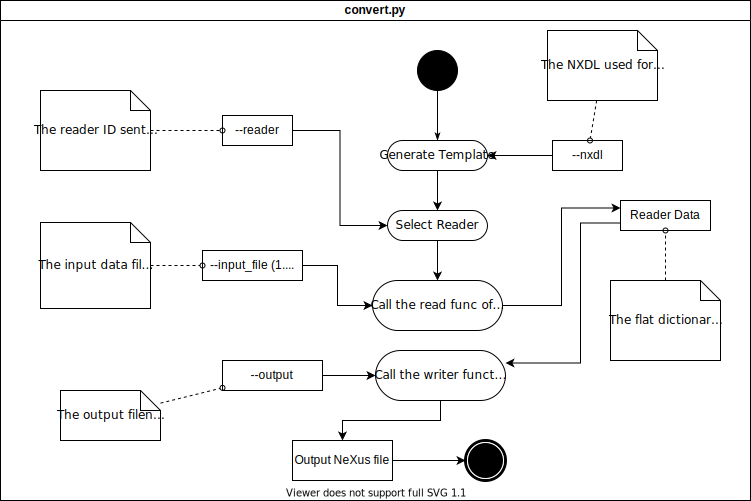

# Dataconverter

This tool converts experimental data to NeXus/HDF5 files based on any provided [NXDL schemas](https://manual.nexusformat.org/nxdl.html#index-1).
It contains a set of [readers](readers/) to convert supported data files into a compliant NeXus file.

You can read specific README's of the readers and find usage examples [here](../../examples/).

## Installation

```console
user@box:~$ pip install pynxtools[convert]
```

## Usage

### Commands
- **convert**: This is the top-level command that allows you to use the converter. It can be called directly with ```dataconverter```.
- **generate-template**: This command generates a reader template dictionary for a given NXDL file. It can be called with ```dataconverter generate-template```.

```console
Usage: dataconverter [OPTIONS] COMMAND [ARGS]...

Commands:
  convert*           This command allows you to use the converter...
  generate-template  Generates and prints a template to use for your nxdl.

Info:
  You can see more options by using --help for specific commands. For example:
  dataconverter generate-template --help
```

#### Merge partial NeXus files into one

```console
user@box:~$ dataconverter --nxdl nxdl partial1.nxs partial2.nxs
```

#### Map an HDF5/JSON/(Python Dict pickled in a pickle file)

```console
user@box:~$ dataconverter --nxdl nxdl any_data.hdf5 --mapping my_custom_map.mapping.json
```

You can find actual examples with data files at [`examples/json_map`](../../examples/json_map/).


#### Use with multiple input files

```console
user@box:~$ dataconverter --nxdl nxdl metadata data.raw otherfile
```

## Writing a Reader

This converter allows extending support to other data formats by allowing extensions called readers.
The converter provides a dev platform to build a NeXus compatible reader by providing checking against a chosen NeXus Application Definition.

Readers have to be placed in the **readers** folder in their own subfolder.
The reader folder should be named with the reader's name and contain a `reader.py`.\
For example: The reader `Example Reader` is placed under [`readers/example/reader.py`](readers/example/reader.py).

Copy and rename `readers/example/reader.py` to your own `readers/mydatareader/reader.py`.

Then implement the reader function:

```python
"""MyDataReader implementation for the DataConverter to convert mydata to NeXus."""
from typing import Tuple, Any

from dataconverter.readers.base.reader import BaseReader


class MyDataReader(BaseReader):
    """MyDataReader implementation for the DataConverter to convert mydata to NeXus."""

    def read(
        self,
        template: dict = None,
        file_paths: Tuple[str] = None,
        objects: Tuple[Any] = None
    ) -> dict:
        """Reads data from given file and returns a filled template dictionary"""
        # Fill the template
        for path in file_paths:
            print(path)

        template["/entry/instrument/scan"] = raw_scan_data

        return template


# This has to be set to allow the convert script to use this reader. Set it to "MyDataReader".
READER = MyDataReader

```

The read function takes a template dictionary based on the provided NXDL file (similar to `dataconverter generate-template`) and the list of all the file paths the user provides.
The returned dictionary should contain keys that exist in the template as defined below.
The values of these keys have to be data objects to be populated in the output NeXus file.
They can be lists, numpy arrays, numpy bytes, numpy floats, numpy ints. Practically you can pass any value that can be handled by the `h5py` package.

The dataconverter can be executed using:

```console
user@box:~$ dataconverter --reader mydatareader --nxdl NXmynxdl --output path_to_output.nxs
```

### The reader template dictionary

Example:

```json
{
  "/entry/instrument/source/type": "None"
}
```

**Units**: If there is a field defined in the NXDL, the converter expects a filled in /data/@units entry in the template dictionary corresponding to the right /data field unless it is specified as NX_UNITLESS in the NXDL. Otherwise, you will get an exception.

```json
{
  "/ENTRY[my_entry]/INSTRUMENT[my_instrument]/SOURCE[my_source]/data": "None",
  "/ENTRY[my_entry]/INSTRUMENT[my_instrument]/SOURCE[my_source]/data/@units": "Should be set to a string value"
}
```

In case the NXDL does not define a `name` for the group the requested data belongs to, the template dictionary will list it as `/NAME_IN_NXDL[name_in_output_nexus]`
You can choose any name you prefer instead of the suggested name. This allows the reader function to repeat groups defined in the NXDL to be outputted to the NeXus file.

```json
{
  "/ENTRY[my_entry]/INSTRUMENT[my_instrument]/SOURCE[my_source]/type": "None"
}
```

For attributes defined in the NXDL, the reader template dictionary will have the assosciated key with a "@" prefix to the attributes name at the end of the path:

```json
{
  "/entry/instrument/source/@attribute": "None"
}
```

You can also define links by setting the value to sub dictionary object with key `link`:

```python
template["/entry/instrument/source"] = {"link": "/path/to/source/data"}
```

For a given NXDL schema, you can generate an empty template with the command
```console
user@box:~$ dataconverter generate-template` --nxdl NXmynxdl
```


